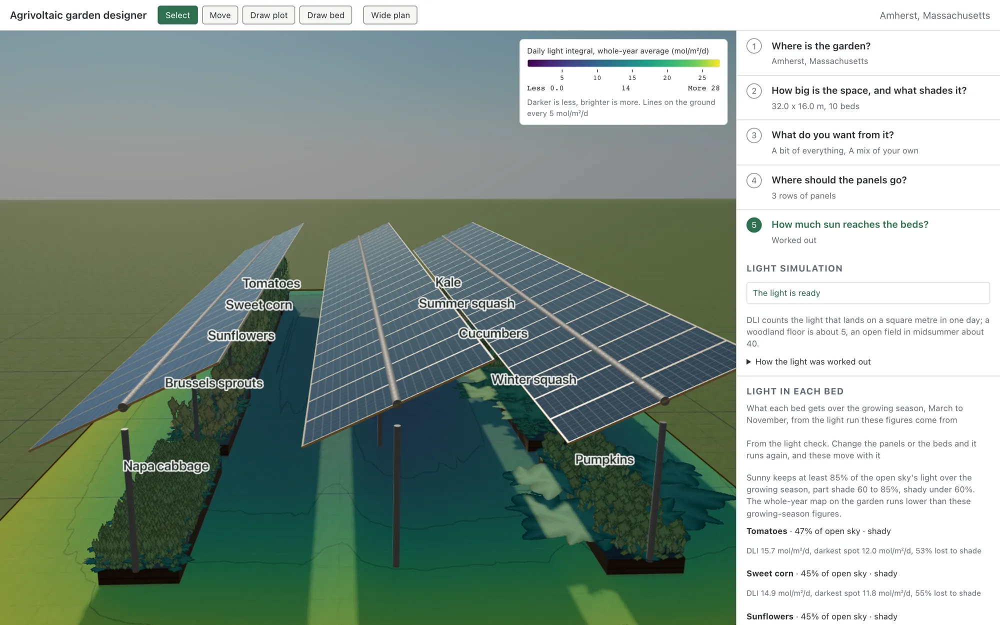

# Agrivoltaic garden designer

Plan a vegetable garden and the solar panels above it, together, for a real address.

**[Live app](https://garden.peterklingelhofer.com)** · [Modelling documents](https://garden.peterklingelhofer.com/docs/)

[](https://garden.peterklingelhofer.com)

You give it a place and a rough rectangle. It looks up that site's sun, weather and soil,
simulates how much light reaches the ground once panels are over it, and works out which crops
still suit each bed and what to plant when. The point of the tool is the trade it makes visible:
every panel that generates electricity takes light off the ground, and the app measures what that
costs rather than guessing.

Every quantitative claim carries its source. Where a figure rests on an inference rather than a
measurement, it says so.

It works at **garden scale**: beds a person can reach across, paths a wheelbarrow fits down,
arrays of a few rows. It is not a farm planning tool and models no tractor or implement access.
Outputs are planning estimates from a model, not agronomic or engineering recommendations, and
nothing here has been validated against a real garden.

The modelling documents behind it are published with the app at
[garden.peterklingelhofer.com/docs/](https://garden.peterklingelhofer.com/docs/), built from `docs/` by
`scripts/render-docs.mjs`. That script carries a whitelist: the science and provenance documents
are published and the internal engineering notes are not.

## Running it

Requires bun 1.2+ and Node 20+. Bun is enforced, npm, yarn and pnpm are refused by a preinstall
check. Node is still needed for the `scripts/*.mjs` tools, the unit suite runs under bun.

```sh
bun install
bun run dev          # app on :5173, without the conversational panel
```

The chat panel is off in `bun run dev` and in a deployed build. `VITE_AGENT=on bun run dev` turns it
on, `src/agent/flag.ts` has the rule and the reason.

Under plain `bun run dev` the dev server proxies weather (Open-Meteo), elevation (Open-Elevation)
and place-name lookups (Nominatim, Photon) straight to their upstreams, so a site resolves with
nothing else running, `dev-proxy.ts` holds the table. PVGIS, NSRDB and the EIA retail price route
through the Cloudflare Worker, and with no worker listening those requests fail and the app uses its
fallbacks. To exercise them run the worker too:

```sh
bun run dev:worker   # worker on :8787, proxied from the dev server
```

## Checks

```sh
bun run typecheck
bun run lint
bun run test         # bun test
bun run test:e2e     # playwright
bun run check        # biome, writes fixes
```

`bun run generate` re-renders the citation corpus. `docs/CITATIONS.md` and
`src/types/citation-ids.generated.ts` are both derived from `docs/CITATIONS.csl.json`, so a
citekey that is not in the corpus is a compile error rather than a broken link.

## Where things are

| Path | What lives there |
|---|---|
| `src/scene/` | three.js and react-three-fiber: geometry, lighting, the light overlay, the render pipeline |
| `src/sim/` | the light simulation and the compliance checks |
| `src/recommend/` | crop ranking, polyculture suggestions, and the layout search behind "Show me some layouts" |
| `src/state/` | the zustand store, persistence, and the bridges between the store and the engines |
| `src/ui/` | the ten-step column and its panels, and the design system in `src/index.css` |
| `src/data/` | the crop catalogue, companion rules, citations, and the upstream data clients |
| `workers/` | the Cloudflare Worker proxy |
| `e2e/` | Playwright suites, including first-time-user personas |

## Reading further

`docs/` carries the reasoning, not just the API surface:

- `docs/ARCHITECTURE.md`, `docs/00-DECISIONS.md`: how it is put together and why
- `docs/02-agrivoltaics-science.md` through `docs/07-electrical-grid.md`: the domain background
- `docs/CITATIONS.md`: the corpus, with verification status and evidence tier per source
- `docs/VERIFICATION.md`: the project auditing its own claims, including errors it caught
- `docs/CI.md`: the pipeline

## Status

CI runs on every push to `main` and every pull request: typecheck, lint, format, the unit suite, the
Rust crate checks, the production build, and the functional Playwright project. Two tests skip on
the runner because it has no real GPU, see `docs/CI.md`, which lists them.

## Licence

The code is under the Apache License 2.0 (`LICENSE`). The documents in `docs/` and the data in
`data/` and `public/data/` are under CC BY 4.0 (`LICENSE-DOCS`), third-party datasets keep their own
terms, listed in `public/data/manifest.json`. Third-party code transcribed into the repository is
credited in `NOTICE`. To cite the project, use `CITATION.cff`.
